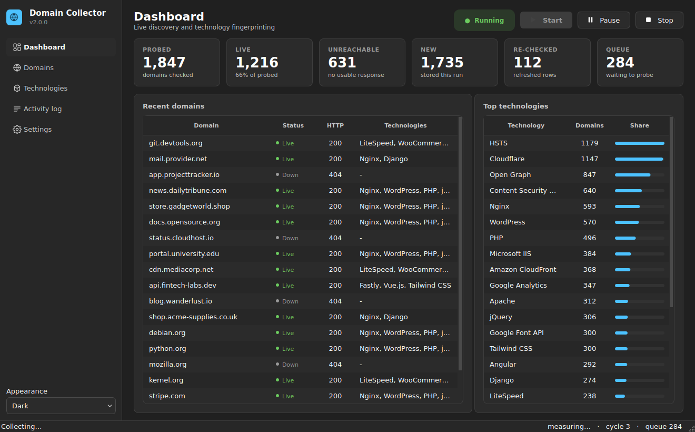
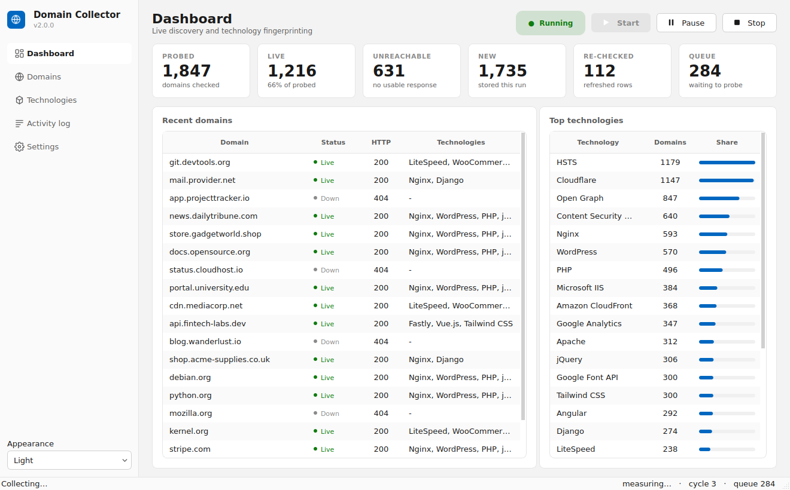
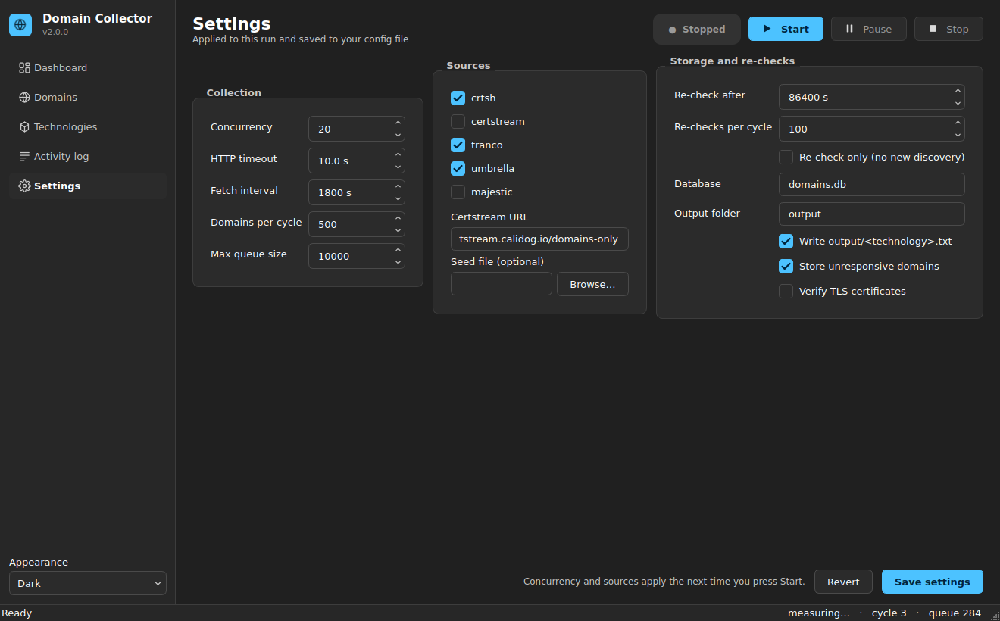

# 🌐 Domain Collector

<p align="center">
  
  
  
  
  
</p>

> *Autonomous, asynchronous domain intelligence & technology fingerprinting framework*

<p align="center">
  
</p>

---

Domain Collector continuously discovers domains from public feeds, checks whether they
answer over HTTP/HTTPS, fingerprints the technology stack behind them, and files the
results into a SQLite database and technology-specific text files — with no duplicates.

It runs as a **native-feeling desktop app** (PySide6 / Qt 6, with a Tk fallback) or
**fully headless in a terminal**.

---

## 🎯 What it does

- 🔍 **Discovers** domains from several public feeds — Certificate Transparency in real
  time over a **certstream websocket**, crt.sh searches, the Tranco / Cisco Umbrella /
  Majestic ranking lists, or your own seed file
- ✅ **Validates** every candidate (punycode, label rules, TLD sanity, no IPs or wildcards)
  before a single request is made
- 🌐 **Probes** each domain over HTTPS, falling back to HTTP
- 🧬 **Fingerprints** the stack — web servers, CDNs, CMSs, frameworks, JS libraries,
  analytics, security headers — from response headers, cookies, `<meta>` tags and HTML,
  including version numbers where they are exposed
- 📁 **Writes** `output/<technology>.txt` in real time, one domain per line
- 🔁 **Re-checks** stored domains on a schedule, so the dataset tracks stacks that change
- 🛡️ **Deduplicates** in memory *and* in SQLite, so a domain is never probed or stored twice
- ⚡ **Scales** with configurable concurrency and a bounded work queue

---

## 📦 Installation

```bash
git clone https://github.com/G33l0/All-Domain.git
cd All-Domain
pip install -r requirements.txt
```

Requirements: **Python 3.9+**, `aiohttp`, `aiosqlite`, `idna`, and `PySide6` for the
desktop app. On Windows that is all you need — `pip install PySide6` pulls in Qt 6 itself.

The collector picks an interface automatically: **Qt if PySide6 is installed**, otherwise
the built-in **Tk** fallback, otherwise **headless**. Force one with `--ui qt` / `--ui tk`.

<details>
<summary>Running the Tk fallback instead</summary>

Some Python builds ship Tk separately:

```bash
sudo apt install python3-tk      # Debian / Ubuntu
sudo dnf install python3-tkinter # Fedora
```

Linux users running the Qt app on a bare container may also need
`libegl1 libgl1 libxkbcommon0 libdbus-1-3` — desktop installs already have them.
</details>

---

## 🚀 Usage

```bash
# Desktop app (Qt when PySide6 is installed, else Tk, else headless)
python domain_collector.py

# Pick the interface and theme explicitly
python domain_collector.py --ui qt --theme dark

# Headless, runs until you press Ctrl+C
python domain_collector.py --headless

# One fetch cycle of 100 domains, 50 at a time, then exit
python domain_collector.py --headless --once --limit 100 --concurrency 50

# Feed it your own list instead of the public sources
python domain_collector.py --headless --sources file --seed-file my-domains.txt

# Live Certificate Transparency stream (see the certstream note below)
python domain_collector.py --headless --sources certstream \
    --certstream-url ws://127.0.0.1:8080/domains-only

# Discover new domains and re-check anything last seen over a day ago
python domain_collector.py --headless --recheck-after 86400 --recheck-batch 200

# Re-check only: refresh what is already stored, discover nothing new
python domain_collector.py --headless --recheck-after 86400 --recheck-only

# Inspect what has been collected so far
python domain_collector.py --stats
python domain_collector.py --export WordPress > wordpress-sites.txt
```

`Ctrl+C` stops gracefully: in-flight probes finish, buffered rows are flushed, the
database and HTTP sessions are closed. Press it twice to force an immediate exit.

### Command line options

| Option | Description |
|---|---|
| `--headless`, `--no-gui` | Run in the terminal instead of opening the desktop app |
| `--ui {auto,qt,tk}` | Which desktop interface to use |
| `--theme {system,light,dark}` | Qt colour theme (default: follow the OS) |
| `--once` / `--cycles N` | Stop after one / N fetch cycles |
| `--concurrency N` | Simultaneous probes (default 20) |
| `--timeout SECONDS` | Per-request timeout (default 10) |
| `--interval SECONDS` | Delay between fetch cycles (default 1800) |
| `--limit N` | Max domains queued per cycle (default 500) |
| `--sources LIST` | `crtsh`, `certstream`, `tranco`, `umbrella`, `majestic`, `file` (comma separated) |
| `--seed-file PATH` | Local file of candidate domains, one per line |
| `--certstream-url URL` | Certstream websocket to stream CT logs from |
| `--recheck-after SECONDS` | Re-probe stored domains older than this (`0` disables) |
| `--recheck-batch N` | How many stale domains to re-queue per cycle |
| `--recheck-only` | Refresh stored domains only, discover nothing new |
| `--db PATH` / `--output DIR` | Database and technology-file locations |
| `--responsive-only` | Store only domains that answered |
| `--no-tech-files` | Database only, skip `output/*.txt` |
| `--verify-ssl` | Verify TLS certificates (off by default — many live hosts have broken chains) |
| `--use-builtwith` | Additionally run the optional legacy `builtwith` package |
| `--stats` / `--export TECH` | Report on the database, then exit |
| `--save-config` | Write the resulting settings to the config file and exit |
| `-c`, `--config PATH` | Config file to use (default `config.json`) |

---

## ⚙️ Configuration

Settings live in `config.json` (created by `--save-config` or by the GUI's **Settings**
dialog). Command line flags override the file for a single run.

| Key | Default | Description |
|---|---|---|
| `concurrency` | `20` | Simultaneous HTTP probes |
| `http_timeout` | `10` | Timeout in seconds for each request |
| `fetch_interval` | `1800` | Seconds between fetch cycles |
| `max_queue_size` | `10000` | Bounded in-memory work queue |
| `max_domains_per_cycle` | `500` | How many candidates to queue per cycle |
| `max_body_bytes` | `262144` | Hard cap on how much HTML is downloaded per domain |
| `db_path` | `domains.db` | SQLite database |
| `output_dir` | `output` | Technology text files |
| `cache_dir` | `.cache` | Cached ranking lists and feed positions |
| `sources` | `["crtsh","tranco","umbrella"]` | Enabled feeds, tried in order |
| `seed_file` | `null` | Optional local candidate list |
| `certstream_url` | `wss://certstream.calidog.io/domains-only` | Certstream websocket |
| `certstream_buffer` | `20000` | Streamed domains held between cycles |
| `certstream_wait` | `15` | Seconds a fetch waits for the stream to produce names |
| `recheck_after` | `0` | Re-probe domains older than this many seconds (`0` = off) |
| `recheck_batch` | `100` | Stale domains re-queued per cycle |
| `recheck_only` | `false` | Skip discovery, re-check stored domains only |
| `verify_ssl` | `false` | Verify TLS certificates |
| `write_tech_files` | `true` | Write `output/<technology>.txt` |
| `store_unresponsive` | `true` | Keep unreachable domains in the database |
| `use_builtwith` | `false` | Also run the optional `builtwith` package |
| `log_level` | `INFO` | `DEBUG`, `INFO`, `WARNING`, `ERROR` |

Every value is range-checked on load — a bad config is reported clearly instead of
crashing the collector mid-run.

---

## 📁 Output

```
All-Domain/
├── domains.db          # every domain, with status, versions, timings and source
├── output/             # one file per detected technology
│   ├── Nginx.txt
│   ├── WordPress.txt
│   └── React.txt
├── .cache/             # cached ranking lists + per-source read positions
└── config.json         # your settings
```

The database keeps more than the text files do:

```sql
-- domains:     fingerprint, raw, first_seen, responsive, technologies (JSON),
--              status_code, scheme, error, elapsed_ms, source, checked_at
-- domain_tech: fingerprint, technology, version
SELECT technology, COUNT(*) FROM domain_tech GROUP BY technology ORDER BY 2 DESC;
```

Databases written by version 1.x are migrated automatically on first open.

---

## 📡 Live Certificate Transparency (certstream)

The `certstream` source holds a **persistent websocket** to a
[certstream-server](https://github.com/d-Rickyy-b/certstream-server-go) and buffers every
name it sees; each cycle drains the buffer. It understands both message shapes — the full
`certificate_update` payload and the lighter `domains-only` feed — ignores heartbeats,
strips wildcards, and reconnects with exponential backoff if the server hangs up.

> ⚠️ **The public `certstream.calidog.io` server accepts connections but is frequently
> idle** — it will connect and then send nothing. When that happens the source reports
> `no certificates received`, goes on cooldown, and the other configured sources carry the
> cycle. For a dependable live feed, run your own certstream-server-go and point
> `--certstream-url` at it.

---

## 🔁 Re-check scheduling

Domains are probed once when discovered. Set `recheck_after` and the producer also
re-queues rows whose `checked_at` is older than that, oldest first, `recheck_batch` per
cycle:

```bash
python domain_collector.py --headless --recheck-after 86400   # daily refresh
python domain_collector.py --headless --recheck-after 604800 --recheck-only
```

A re-check **updates the existing row in place** — status, technologies, timing and
`checked_at` — rather than inserting a duplicate. Technologies that disappeared are
removed rather than merged, and a domain is never appended twice to the same
`output/<technology>.txt`. Rows written by the 1.x collector have no `checked_at`, so they
fall back to `first_seen` and are refreshed first.

---

## 🧠 How it works

1. **Producer** re-queues any domains due for a re-check, then asks each configured
   source for new candidates. A source that fails
   (crt.sh regularly returns HTTP 502) is put on an escalating cooldown while the
   others carry on — one dead feed never stops the run.
2. Candidates are **normalised** (`https://Example.COM:8443/x` → `example.com`,
   `*.a.b.com` → `a.b.com`, IDN → punycode) and rejected if they are not real domains.
3. Each new fingerprint is **reserved** in memory and pushed onto a bounded queue.
4. **Consumers** probe HTTPS, then HTTP, reading at most `max_body_bytes` of the body,
   and fingerprint the response headers, cookies, meta tags and HTML.
5. Results are **batched** into SQLite (WAL mode, `executemany`) and appended to the
   technology files.
6. The producer sleeps for `fetch_interval` and goes again — interruptibly.

The ranking lists are cached on disk for 24 hours and read a window at a time, so each
cycle brings *new* domains rather than re-probing the same first N entries.

---

## 🖥️ The desktop app

Built with **PySide6 (Qt 6)** and styled to match Windows 11 / Fluent, so it looks at home
on Windows and identical on Linux and macOS.

| | |
|---|---|
|  |  |

- **Sidebar navigation** — Dashboard, Domains, Technologies, Activity log, Settings
- **Light / dark / follow-the-system** theming, switched live from the sidebar; on Qt 6.5+
  it follows the OS the moment you change it in Windows Settings
- **Dashboard** with live stat cards (probed, live, unreachable, new, re-checked, queue),
  a rolling feed of recent domains and a ranked technology chart
- **Domains page** — sortable table, instant search across domains *and* technologies,
  a "live only" toggle, and CSV export of whatever the filter is showing
- **Technologies page** — every detected technology with a share bar, filterable, plus a
  shortcut to the output folder
- **Activity log** — colour-coded by severity, capped at 3000 lines, saveable to a file
- **Settings page** — every option with proper spin boxes, validation and inline errors,
  saved to `config.json`
- Crisp high-DPI icons (inline SVG, no image assets), system tray icon, remembered window
  size and position, and a close prompt that stops collection cleanly

The engine runs on its own event loop in a worker thread; the window drains its event
queue from a `QTimer`, so no Qt object is ever touched from the collector thread.

### Building a Windows .exe

```powershell
pip install pyinstaller PySide6
pyinstaller packaging/domain-collector.spec
```

That produces `dist/DomainCollector.exe` — a single file that opens the app with no
console window. Pass `--headless` to the same binary to use it as a CLI.

### The Tk fallback

The original Tk interface is still there for environments without PySide6 (`--ui tk`).
It carries the same controls, counters, log and settings, in a plainer package.

---

## 🧪 Tests

```bash
pip install pytest pytest-asyncio
python -m pytest
```

161 tests cover domain normalisation, technology detection, the store (including 1.x
database migration and re-check updates), source parsing and caching, certstream against a
local websocket server, the threaded runner, the CLI, the Qt interface (models, theming,
filtering, settings round-trip — run offscreen, skipped when PySide6 is absent), and full
producer/consumer cycles against a real local HTTP server.

---

## 🛡️ Ethical considerations

- **Public sources only.** Certificate Transparency logs and published ranking lists.
- **Be polite.** `concurrency` is yours to tune; `limit_per_host` is capped at 4 and each
  domain is requested at most twice (HTTPS, then HTTP). No content scraping, no crawling
  beyond the landing page, no brute forcing.
- **Legal use.** Security research, technology-adoption analysis, and public dataset
  building. Do not use it to attack or probe systems you are not authorised to test.

---

## 🤝 Contributing

Adding a source is a subclass of `Source` in `domaincollector/sources.py` plus an entry in
`SOURCE_CLASSES`. Adding a fingerprint is one `Rule` in `domaincollector/tech.py`. Please
run `python -m pytest` before opening a pull request.

---

## 📄 License

MIT — see [LICENSE](LICENSE).

---

Happy Recon! – IamG2ont
