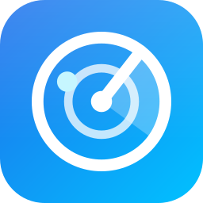
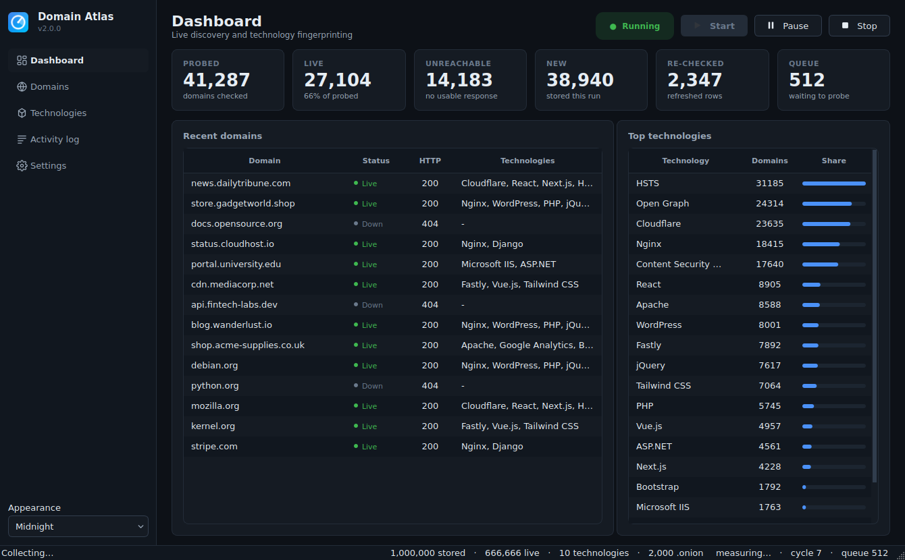
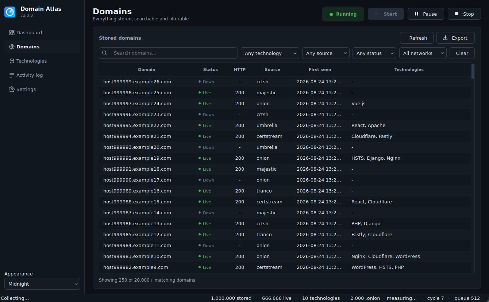
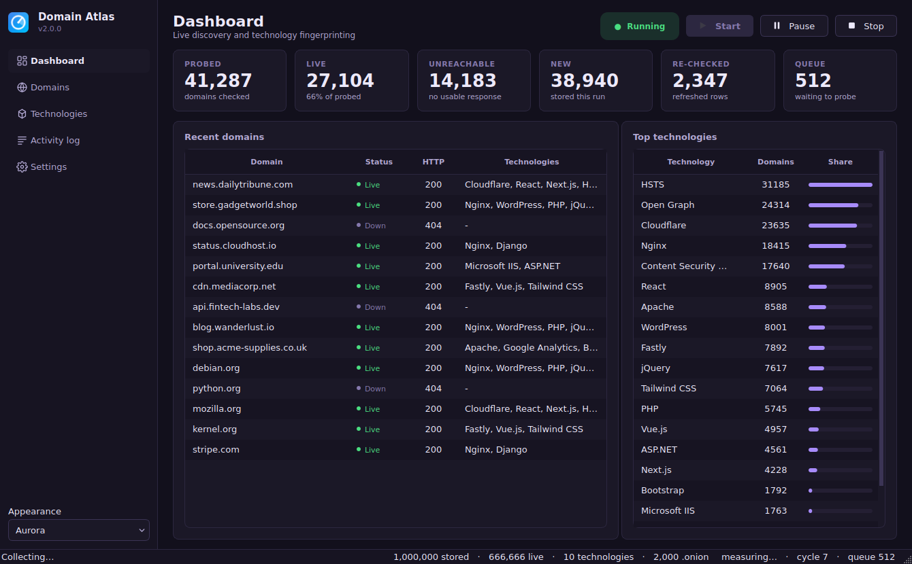
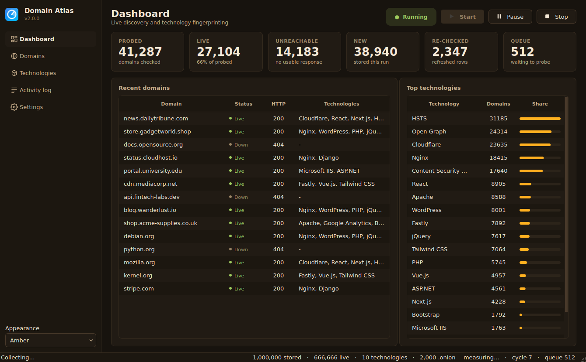
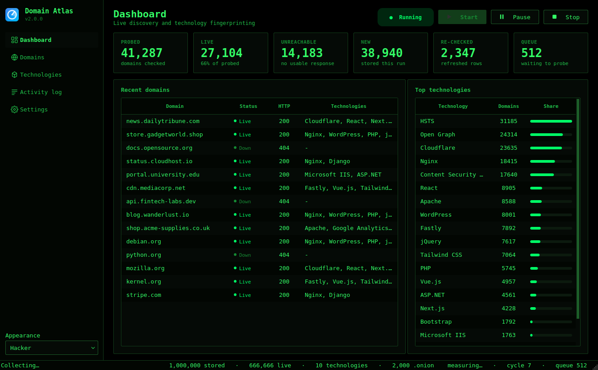

<p align="center">
  
</p>

<h1 align="center">Domain Atlas</h1>

<p align="center">
  Asynchronous domain discovery, technology fingerprinting and inventory.
</p>

<p align="center">
  
  
  
  
</p>

<p align="center">
  
</p>

Domain Atlas continuously discovers domains from public feeds, checks whether they
respond over HTTP or HTTPS, identifies the technologies behind them, and keeps the
results in a queryable SQLite inventory. It runs as a desktop application or headless
from a terminal.

## Features

- **Multiple discovery sources** — live Certificate Transparency over certstream, crt.sh
  searches, the Tranco, Cisco Umbrella and Majestic ranking lists, Tor hidden-service
  indexes, and local seed files. Sources fail independently and are retried on a cooldown.
- **Technology fingerprinting** — 70+ built-in rules covering web servers, CDNs, CMSs,
  frameworks, JavaScript libraries, analytics and security headers, with version capture,
  derived from response headers, cookies, meta tags and HTML.
- **Deduplicated inventory** — a domain is probed once and stored once, enforced both in
  memory and by the database schema.
- **Scheduled re-checks** — stored domains can be re-probed on an interval, updating
  their record in place rather than duplicating it.
- **Tor support** — `.onion` addresses are discovered and stored on the clear web, and
  probed through a SOCKS5 proxy when one is configured.
- **Filtered export** — CSV, JSON, JSON Lines or plain domain lists, filtered by
  technology, source, status, network or first-seen date, streamed from disk.
- **Scales to large inventories** — the desktop table pages through a multi-million row
  database with keyset pagination; every query runs off the UI thread.
- **Six themes** — Light, Dark, Midnight, Aurora, Amber and a monospaced Hacker theme.

## Installation

```bash
git clone https://github.com/G33l0/All-Domain.git
cd All-Domain
pip install -r requirements.txt
```

Requires Python 3.9 or newer. `PySide6` provides the desktop interface; without it the
application falls back to a bundled Tk interface, or runs headless.

Optional extras:

```bash
pip install aiohttp-socks    # probe .onion services through Tor
pip install pyinstaller      # build a Windows executable
```

On a minimal Linux container the Qt libraries need
`libegl1 libgl1 libxkbcommon0 libdbus-1-3`; desktop installations already have them.

## Usage

```bash
python domain_atlas.py                          # desktop application
python domain_atlas.py --ui qt --theme midnight # pick interface and theme
python domain_atlas.py --headless               # terminal, Ctrl+C to stop
python domain_atlas.py --headless --once --limit 100
```

Discovery and inventory:

```bash
# collect from specific sources
python domain_atlas.py --headless --sources certstream,tranco,onion

# re-check anything last seen more than a day ago
python domain_atlas.py --headless --recheck-after 86400 --recheck-batch 200

# refresh stored records only, discover nothing new
python domain_atlas.py --headless --recheck-after 86400 --recheck-only

# probe Tor hidden services through a local Tor daemon
python domain_atlas.py --headless --sources onion --tor-proxy socks5://127.0.0.1:9050
```

Reporting and export:

```bash
python domain_atlas.py --stats

python domain_atlas.py --export wordpress.csv --filter-technology WordPress --filter-live
python domain_atlas.py --export onions.jsonl --filter-onion
python domain_atlas.py --export - --filter-source certstream --filter-since 2026-01-01
```

### Command line reference

| Option | Description |
| --- | --- |
| `--headless`, `--no-gui` | Run in the terminal instead of the desktop application |
| `--ui {auto,qt,tk}` | Interface to use |
| `--theme NAME` | `system`, `light`, `dark`, `midnight`, `aurora`, `amber`, `hacker` |
| `--once`, `--cycles N` | Stop after one or N fetch cycles |
| `--concurrency N` | Simultaneous probes (default 20) |
| `--timeout SECONDS` | Per-request timeout (default 10) |
| `--interval SECONDS` | Delay between fetch cycles (default 1800) |
| `--limit N` | Domains queued per cycle (default 500) |
| `--sources LIST` | `crtsh`, `certstream`, `tranco`, `umbrella`, `majestic`, `onion`, `file` |
| `--seed-file PATH` | Local candidate list, one domain per line |
| `--certstream-url URL` | Certstream websocket endpoint |
| `--tor-proxy URL` | SOCKS5 proxy for `.onion` probing |
| `--recheck-after SECONDS` | Re-probe records older than this (`0` disables) |
| `--recheck-batch N`, `--recheck-only` | Re-check volume, and re-check without discovery |
| `--db PATH`, `--output DIR` | Database and technology-file locations |
| `--responsive-only`, `--no-tech-files` | Storage behaviour |
| `--verify-ssl` | Verify TLS certificates (off by default) |
| `--stats` | Print inventory statistics and exit |
| `--export PATH` | Export and exit; `-` writes to standard output |
| `--export-format` | `csv`, `json`, `jsonl`, `txt` (default: from the file extension) |
| `--filter-technology`, `--filter-source`, `--filter-contains`, `--filter-since` | Export filters |
| `--filter-live`, `--filter-down`, `--filter-onion`, `--filter-clearnet` | Export filters |
| `--save-config` | Write the resulting settings to the config file and exit |

## Desktop application

<p align="center">
  
</p>

Built with PySide6 (Qt 6) and styled to match Windows 11, with identical rendering on
Linux and macOS.

- **Dashboard** — live counters, a rolling feed of recent results, and a ranked
  technology breakdown.
- **Domains** — the full inventory with search, technology, source, status and network
  filters. Rows load a page at a time as the table is scrolled.
- **Technologies** — every detected technology with its share of the inventory.
- **Activity log** — colour-coded, bounded, and saveable to a file.
- **Settings** — every option with validation, persisted to `config.json`.

All database work happens on a worker thread, so filtering or scrolling a large
inventory never blocks the interface.

### Themes

| | | |
| --- | --- | --- |
|  |  |  |
| Light | Dark | Midnight |
|  |  |  |
| Aurora | Amber | Hacker |

The theme follows the operating system by default and can be changed from the sidebar.

### Building a Windows executable

```powershell
pip install pyinstaller PySide6
python packaging/make_icons.py
pyinstaller packaging/domain-atlas.spec
```

Produces `dist/DomainAtlas.exe`, a single file with no console window. The same binary
accepts `--headless` for command line use.

## Configuration

Settings live in `config.json`, created by `--save-config` or by the Settings page.
Command line flags override the file for a single run, and every value is range-checked
on load.

| Key | Default | Description |
| --- | --- | --- |
| `concurrency` | `20` | Simultaneous probes |
| `http_timeout` | `10` | Per-request timeout in seconds |
| `fetch_interval` | `1800` | Seconds between fetch cycles |
| `max_queue_size` | `10000` | Bounded in-memory work queue |
| `max_domains_per_cycle` | `500` | Candidates queued per cycle |
| `max_body_bytes` | `262144` | Maximum HTML downloaded per domain |
| `db_path` | `domains.db` | SQLite inventory |
| `output_dir` | `output` | Per-technology text files |
| `cache_dir` | `.cache` | Cached source lists and read positions |
| `sources` | `crtsh, tranco, umbrella` | Enabled feeds, tried in order |
| `certstream_url` | `wss://certstream.calidog.io/domains-only` | Certificate Transparency stream |
| `onion_index_url` | `https://ahmia.fi/onions/` | Public hidden-service index |
| `tor_proxy` | *(empty)* | SOCKS5 proxy for `.onion` probing |
| `recheck_after` | `0` | Re-probe records older than this (`0` disables) |
| `recheck_batch` | `100` | Stale records re-queued per cycle |
| `recheck_only` | `false` | Skip discovery and only refresh stored records |
| `verify_ssl` | `false` | Verify TLS certificates |
| `write_tech_files` | `true` | Write `output/<technology>.txt` |
| `store_unresponsive` | `true` | Keep unreachable domains in the inventory |
| `log_level` | `INFO` | `DEBUG`, `INFO`, `WARNING`, `ERROR` |

## Architecture

```
domainatlas/
  cli.py        command line entry point and argument handling
  config.py     validated settings, loaded from and saved to JSON
  domains.py    parsing, validation and normalisation of host names
  engine.py     producer/consumer collection loop
  sources.py    discovery feeds and the source registry
  tech.py       technology fingerprint rules
  store.py      batched SQLite writes and per-technology files
  query.py      read-only paged queries and filters
  export.py     streaming CSV/JSON/JSONL/TXT export
  runner.py     background thread wrapper for the interfaces
  gui.py        Tk fallback interface
  qtui/         PySide6 desktop application
```

A producer resolves candidates from each source, normalises them
(`https://Example.COM:8443/x` → `example.com`, `*.a.b.com` → `a.b.com`, IDN to punycode)
and rejects anything that is not a routable host name. New fingerprints are reserved in
memory and queued. Consumers probe HTTPS, then HTTP, read at most `max_body_bytes` of the
response and fingerprint it. Results are batched into SQLite in WAL mode and appended to
the technology files.

Reads never touch the write path: `query.py` opens its own read-only connection and pages
with keyset pagination, so page 10,000 costs the same as page 1.

### Data model

```sql
-- domains:     fingerprint, raw, first_seen, responsive, technologies, status_code,
--              scheme, error, elapsed_ms, source, checked_at
-- domain_tech: fingerprint, technology, version

SELECT technology, COUNT(*) FROM domain_tech GROUP BY technology ORDER BY 2 DESC;
```

Databases written by earlier versions are migrated automatically on first open.

### Adding a source

Subclass `Source` and register it:

```python
from domainatlas.sources import Source, register_source

@register_source
class MyFeed(Source):
    name = "my-feed"

    async def fetch(self, session, limit):
        async with session.get("https://example.com/domains.txt") as response:
            body = await response.text()
        return body.split()[:limit]
```

Third-party packages can register sources without modifying the codebase by advertising
them on the `domain_atlas.sources` entry point group:

```toml
[project.entry-points."domain_atlas.sources"]
my-feed = "mypackage.feeds:MyFeed"
```

## Tests

```bash
pip install pytest pytest-asyncio
python -m pytest
```

215 tests cover normalisation, fingerprinting, storage and migration, source parsing and
caching, certstream against a local websocket server, the query and export layers, the
threaded runner, the command line, and the desktop interface. Qt tests run on the
offscreen platform and are skipped when PySide6 is unavailable.

## Scope and limits

- No source enumerates the entire DNS namespace, and Domain Atlas does not claim to.
  It aggregates what public feeds publish — Certificate Transparency covers any host that
  has ever been issued a TLS certificate, which is the broadest practical view available.
  Coverage grows with the number of configured sources and how long the collector runs.
- Hidden services are discovered from public clear-web indexes. Probing them requires a
  running Tor daemon and `aiohttp-socks`; without those, `.onion` records are stored and
  exportable but marked as unprobed.
- The public `certstream.calidog.io` endpoint accepts connections but is frequently idle.
  Point `certstream_url` at a self-hosted
  [certstream-server-go](https://github.com/d-Rickyy-b/certstream-server-go) for a
  dependable live feed.

## Responsible use

Domain Atlas reads public data sources and issues at most two HTTP requests per domain to
its landing page. It does not crawl, brute force or fetch content beyond that. Concurrency
is configurable and the caller is responsible for setting it appropriately. Use it for
security research, technology adoption analysis and asset inventory, and only against
systems you are authorised to assess.

## License

MIT. See [LICENSE](LICENSE).
